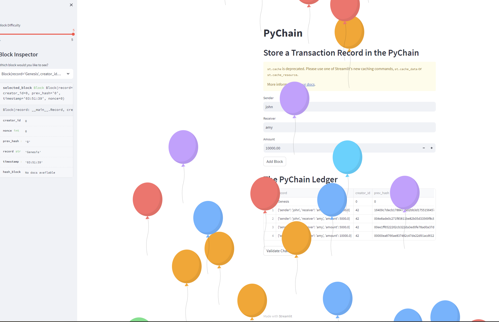
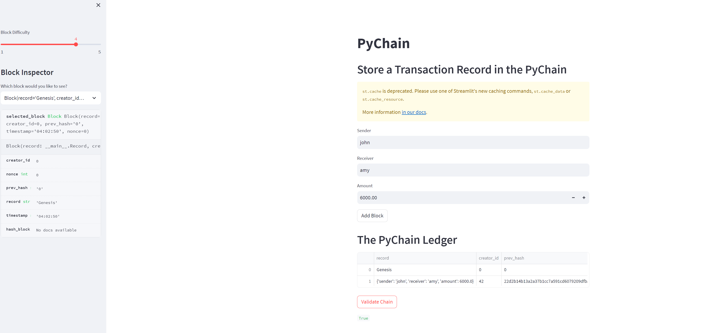

# Blockchain-based Ledger System

## The project is to build a Pychain ledger system with a user-friendly web interface. This ledger will allow partner banks to conduct financial transactions and to verify the integrity of the data in the ledger.

### 1. Create a Record Data Class
* Define a new class named `Record`
* Add the `@dataclass` decorator 
* Add attibutes named `sender`, `receiver` and `amount` 

### 2. Modify the Existing Block Data Class to Store Record Data
* Rename the `data` attribute in your Block class to `record`

### 3. Add Relevant User Inputs to the Streamlit Interface
* Add an input area for `sender`, `receiver` and `amount` from the user
* Also include the attributes for `creator_id` and `prev_hash`

### 4. Test the PyChain Ledger by Storing Records
* In the terminal, run the Streamlit application by using `streamlit run pychain.py`
* A screenshot of my deployed Streamlit application to interact with the project:
  
 
 
 
